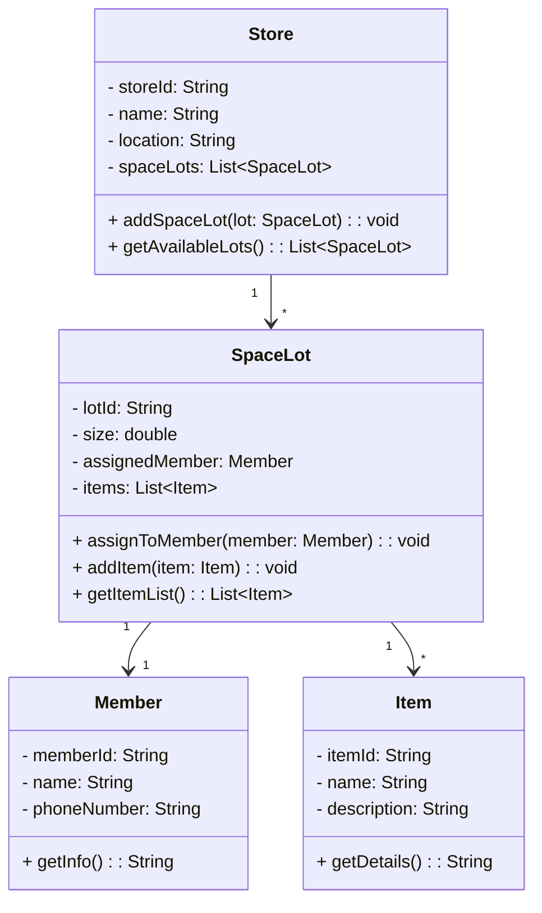

### ✅ Mermaid Class Diagram

```mermaid
classDiagram
    class Store {
        - storeId: String
        - name: String
        - location: String
        - spaceLots: List~SpaceLot~
        + addSpaceLot(lot: SpaceLot): void
        + getAvailableLots(): List~SpaceLot~
    }

    class SpaceLot {
        - lotId: String
        - size: double
        - assignedMember: Member
        - items: List~Item~
        + assignToMember(member: Member): void
        + addItem(item: Item): void
        + getItemList(): List~Item~
    }

    class Member {
        - memberId: String
        - name: String
        - phoneNumber: String
        + getInfo(): String
    }

    class Item {
        - itemId: String
        - name: String
        - description: String
        + getDetails(): String
    }

    Store "1" --> "*" SpaceLot
    SpaceLot "1" --> "1" Member
    SpaceLot "1" --> "*" Item
```

---
