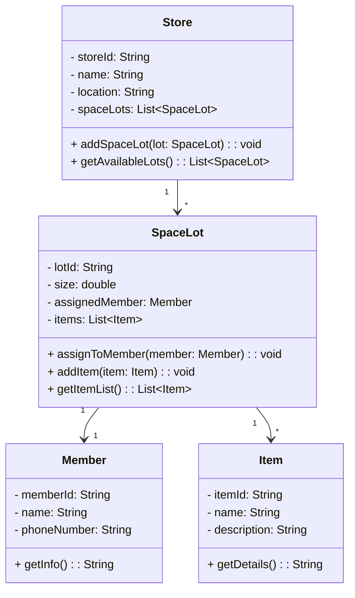

### Share Store System



---

## 📝 Instruction for Students: Share Store System

### 📘 Objective:

You are required to implement a Share Store System using **Java** based on the provided **class diagram**. Your task includes writing the necessary **attributes, constructors, and methods** for the following classes:

* `Store`
* `SpaceLot`
* `Member`
* `Item`

This exercise will help you practice:

* Object-oriented design and implementation
* Relationships between classes (association, aggregation)
* List management and object referencing
* Accessor and mutator methods

---

### 📐 Class Overview and Requirements:

---

#### 🔹 `Store` Class

**Attributes:**

* `storeId: String` – Unique identifier for the store
* `name: String` – Name of the store
* `location: String` – Physical address or description
* `spaceLots: List<SpaceLot>` – List of space lots owned by the store

**Methods:**

* `addSpaceLot(SpaceLot lot): void`
  ➤ Add a `SpaceLot` to the store's list.

* `getAvailableLots(): List<SpaceLot>`
  ➤ Return all the lots currently available in the store.

---

#### 🔹 `SpaceLot` Class

**Attributes:**

* `lotId: String` – Unique identifier for the space lot
* `size: double` – The physical size (in square meters, for example)
* `assignedMember: Member` – The member to whom the lot is assigned (can be `null`)
* `items: List<Item>` – List of items stored in this lot

**Methods:**

* `assignToMember(Member member): void`
  ➤ Assign a member to the space lot. Only one member allowed per lot.

* `addItem(Item item): void`
  ➤ Add an item to the lot’s item list.

* `getItemList(): List<Item>`
  ➤ Return the list of items in the lot.

---

#### 🔹 `Member` Class

**Attributes:**

* `memberId: String` – Unique ID for the member
* `name: String` – Full name of the member
* `phoneNumber: String` – Contact number

**Methods:**

* `getInfo(): String`
  ➤ Return a string with member information in a readable format (e.g., `"John Doe (M123), Phone: 012-3456789"`)

---

#### 🔹 `Item` Class

**Attributes:**

* `itemId: String` – Unique ID for the item
* `name: String` – Name of the item
* `description: String` – Description of the item

**Methods:**

* `getDetails(): String`
  ➤ Return a string with item details in a readable format (e.g., `"Bike: Red mountain bike"`)

---

### 🔧 Skeleton Code

Please fill in the constructors, attributes, and method implementations where indicated.

Below is the **complete Java file** combining all classes (`Store`, `SpaceLot`, `Member`, `Item`) along with the `Main` method.

You can copy and paste this into a `.java` file (e.g., `ShareStoreSystem.java`).

---

### ✅ `ShareStoreSystem.java`

```java
import java.util.*;

// Class: Member
// Represents a member who can rent a space lot
class Member {
    private String memberId;
    private String name;
    private String phoneNumber;

    // Constructor
    public Member(String memberId, String name, String phoneNumber) {
        // TODO: Initialize all fields
    }

    // Return member info
    public String getInfo() {
        // TODO: Return a formatted string like: "Alice (M001), Phone: 012-3456789"
        return null;
    }
}

// Class: Item
// Represents an item stored in a space lot
class Item {
    private String itemId;
    private String name;
    private String description;

    // Constructor
    public Item(String itemId, String name, String description) {
        // TODO: Initialize all fields
    }

    // Return item details
    public String getDetails() {
        // TODO: Return a formatted string like: "Bicycle: Mountain bike"
        return null;
    }
}

// Class: SpaceLot
// Represents a lot within a store assigned to one member and stores multiple items
class SpaceLot {
    private String lotId;
    private double size;
    private Member assignedMember;
    private List<Item> items;

    // Constructor
    public SpaceLot(String lotId, double size) {
        // TODO: Initialize all fields
    }

    // Assign this lot to a member
    public void assignToMember(Member member) {
        // TODO: Set assignedMember
    }

    // Add an item to the lot
    public void addItem(Item item) {
        // TODO: Add item to items list
    }

    // Get list of items
    public List<Item> getItemList() {
        // TODO: Return items list
        return null;
    }

    // Get assigned member
    public Member getAssignedMember() {
        // TODO: Return assigned member
        return null;
    }

    // Get lot ID
    public String getLotId() {
        return lotId;
    }
}

// Class: Store
// Represents a storage facility that owns multiple space lots
class Store {
    private String storeId;
    private String name;
    private String location;
    private List<SpaceLot> spaceLots;

    // Constructor
    public Store(String storeId, String name, String location) {
        // TODO: Initialize all fields
    }

    // Add a space lot to the store
    public void addSpaceLot(SpaceLot lot) {
        // TODO: Add lot to the list
    }

    // Get all space lots
    public List<SpaceLot> getAvailableLots() {
        // TODO: Return space lots list
        return null;
    }

    // Get store name
    public String getName() {
        return name;
    }
}

// Class: Main
// Demonstrates how the system works
public class ShareStoreSystem {
    public static void main(String[] args) {
        // TODO: Create store
        Store store = new Store("S1", "Central Store", "Downtown");

        // TODO: Create members
        Member member1 = new Member("M001", "Alice", "012-3456789");
        Member member2 = new Member("M002", "Bob", "011-9876543");

        // TODO: Create space lots
        SpaceLot lot1 = new SpaceLot("L001", 10.0);
        SpaceLot lot2 = new SpaceLot("L002", 15.0);

        // TODO: Assign lots to members
        lot1.assignToMember(member1);
        lot2.assignToMember(member2);

        // TODO: Add items to lot1
        lot1.addItem(new Item("I001", "Bicycle", "Mountain bike"));
        lot1.addItem(new Item("I002", "Tent", "Camping tent"));

        // TODO: Add items to lot2
        lot2.addItem(new Item("I003", "Kayak", "Inflatable kayak"));
        lot2.addItem(new Item("I004", "Cooler", "Ice box for drinks"));

        // TODO: Add lots to store
        store.addSpaceLot(lot1);
        store.addSpaceLot(lot2);

        // TODO: Display store and lots info
        System.out.println("Store: " + store.getName());
        for (SpaceLot lot : store.getAvailableLots()) {
            System.out.println("\nLot ID: " + lot.getLotId());
            System.out.println("Assigned to: " + lot.getAssignedMember().getInfo());
            System.out.println("Stored Items:");
            for (Item item : lot.getItemList()) {
                System.out.println(" - " + item.getDetails());
            }
        }
    }
}
```

---

### 📘 What Should Do:

1. **Complete all constructors** and **initialize the fields**.
2. **Implement all methods** as described in the comments.
3. **Use appropriate Java collections** (e.g., `ArrayList`) where necessary.
4. Compile and run the code to display the expected output.

---


