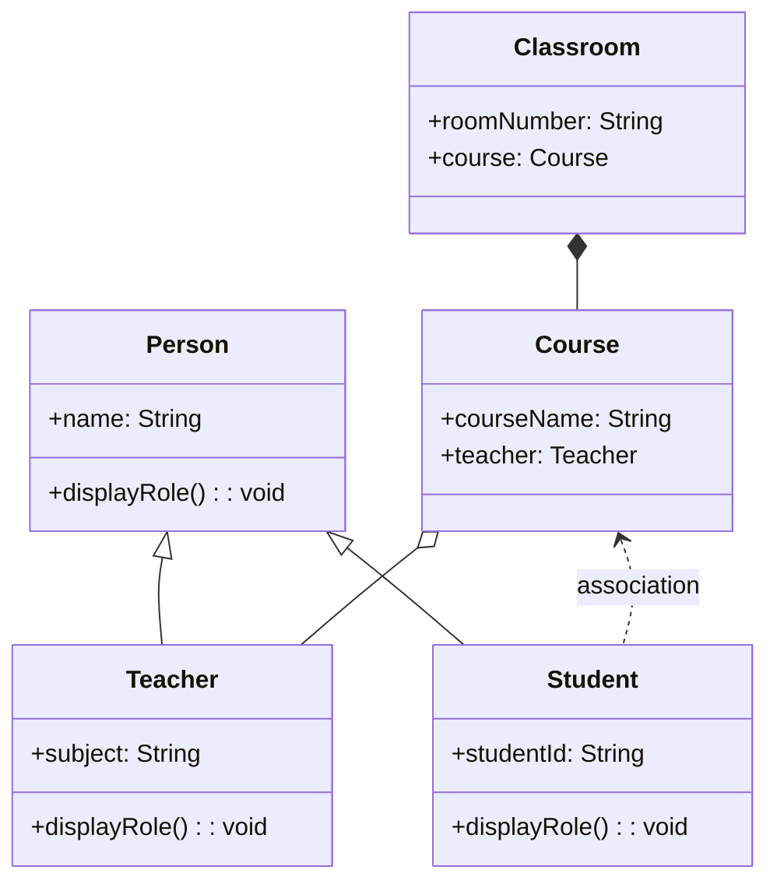

Here is a **Java Lab Exercise** that demonstrates the key **class relationships**: **Association**, **Aggregation**, **Composition**, **Inheritance**, and **Polymorphism**, all in one coherent example.

---

## 🔬 **Lab Exercise: Class Relationships in a School Management System**

### 📝 **Learning Objectives**

* Understand and implement:

  * **Association**
  * **Aggregation**
  * **Composition**
  * **Inheritance**
  * **Polymorphism**

---

## 📘 **Scenario**

Create a simple school management system that models the relationships between the following classes:

* `Person` (Base class)
* `Student`, `Teacher` (Inheritance from `Person`)
* `Course` (Aggregates `Teacher`)
* `Classroom` (Composes `Course`)
* `Student` associated with `Course` (Association)
* Implement polymorphism using overridden methods from the `Person` class.

---

## 🧪 **Instructions**

1. Implement the class structure as shown.
2. Demonstrate the relationships and polymorphism in the `Main` class.
3. Add appropriate comments to explain each relationship.

---

## 🧩 **UML (Mermaid Style)**

---

## 📚 **Explanation Recap**

| Concept      | Example in Code                                    |
| ------------ | -------------------------------------------------- |
| Inheritance  | `Student` and `Teacher` inherit `Person`           |
| Polymorphism | `displayRole()` is overridden                      |
| Association  | `Student` associates with a `Course`               |
| Aggregation  | `Course` has a `Teacher` (can exist independently) |
| Composition  | `Classroom` owns a `Course` (created internally)   |

