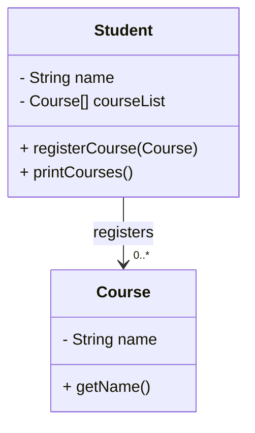
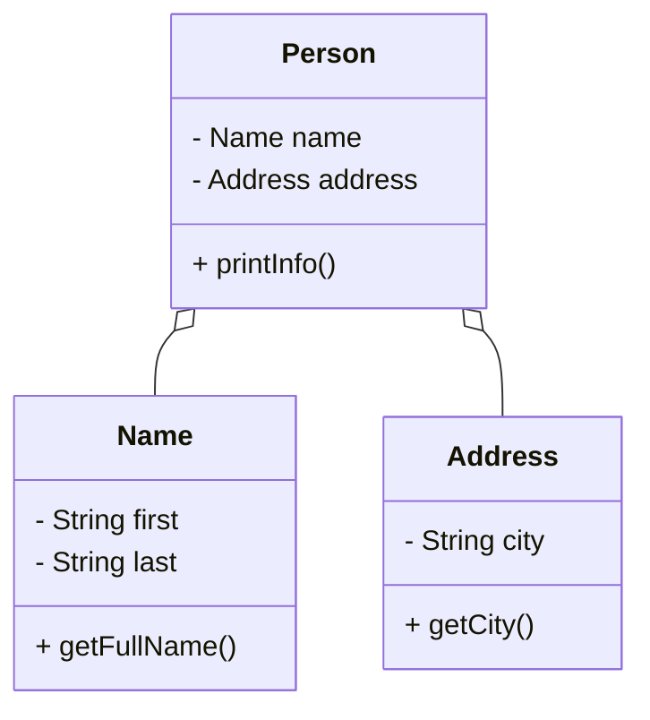
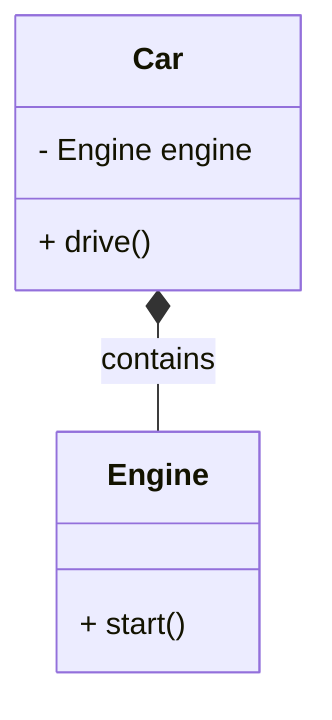
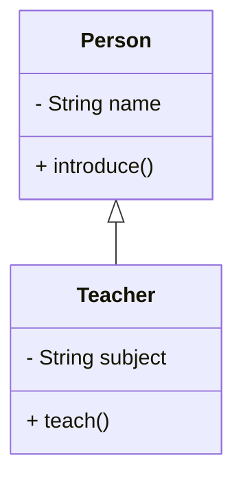

Here's a complete, restructured chapter on **Class Relationships in Java**, based on your uploaded slides and your requirements. It includes explanations, comparisons, class diagrams, and runnable Java code for each relationship type: **Association, Aggregation, Composition, and Inheritance**.

---

# 🧩 Java Class Relationships

Java class relationships describe how objects interact or are related in an object-oriented system. These relationships include:

1. **Association**
2. **Aggregation**
3. **Composition**
4. **Inheritance**

---

## 1. 📎 Association

### 🔹 What is it?

A **general relationship** where one class is connected to another. It shows how objects use each other.

* Example: A `Student` registers multiple `Course`s.
* It can be **unidirectional** or **bidirectional**.

### 📊 Class Diagram

## 1️⃣ Association (Student ↔ Course)



### 🔧 Java Code Example

```java
class Course {
    private String name;
    public Course(String name) { this.name = name; }
    public String getName() { return name; }
}

class Student {
    private String name;
    private Course[] courseList = new Course[10];
    private int count = 0;

    public Student(String name) { this.name = name; }
    public void registerCourse(Course c) { courseList[count++] = c; }
    public void printCourses() {
        System.out.println("Courses for " + name + ":");
        for (int i = 0; i < count; i++)
            System.out.println("- " + courseList[i].getName());
    }
}

public class TestAssociation {
    public static void main(String[] args) {
        Course oop = new Course("OOP");
        Course dsa = new Course("DSA");

        Student s = new Student("Ali");
        s.registerCourse(oop);
        s.registerCourse(dsa);

        s.printCourses();
    }
}
```

---

## 2. 🧱 Aggregation (HAS-A Relationship)

### 🔹 What is it?

Aggregation represents a **weaker ownership** relationship. The "part" can exist **independently** of the "whole".

* Example: A `Person` has a `Name` and an `Address`, but these can exist independently.

### 📊 Class Diagram

## 2️⃣ Aggregation (Person has Name and Address)



### 🔧 Java Code Example

```java
class Name {
    private String first, last;
    public Name(String first, String last) {
        this.first = first; this.last = last;
    }
    public String getFullName() { return first + " " + last; }
}

class Address {
    private String city;
    public Address(String city) { this.city = city; }
    public String getCity() { return city; }
}

class Person {
    private Name name;
    private Address address;

    public Person(Name name, Address address) {
        this.name = name;
        this.address = address;
    }

    public void printInfo() {
        System.out.println("Name: " + name.getFullName());
        System.out.println("City: " + address.getCity());
    }
}
```

---

## 3. 🧬 Composition (STRONG HAS-A)

### 🔹 What is it?

Composition is a **stronger form of aggregation**. The "part" **cannot exist** without the "whole".

* Example: A `Car` has an `Engine`. The engine is destroyed when the car is destroyed.

### 📊 Class Diagram

## 3️⃣ Composition (Car contains Engine)



### 🔧 Java Code Example

```java
class Engine {
    public String start() { return "Engine started"; }
}

class Car {
    private final Engine engine = new Engine();
    public void drive() {
        System.out.println(engine.start() + ", Car is moving");
    }
}

public class TestComposition {
    public static void main(String[] args) {
        Car car = new Car();
        car.drive();
    }
}
```

---

## 4. 🧬 Inheritance (IS-A Relationship)

### 🔹 What is it?

Inheritance represents an **is-a** relationship between a **superclass** and a **subclass**.

* Example: A `Teacher` is a `Person`.

### 📊 Class Diagram

## 4️⃣ Inheritance (Teacher is-a Person)



### 🔧 Java Code Example

```java
class Person {
    protected String name;
    public Person(String name) { this.name = name; }
    public void introduce() {
        System.out.println("Hi, I'm " + name);
    }
}

class Teacher extends Person {
    private String subject;
    public Teacher(String name, String subject) {
        super(name);
        this.subject = subject;
    }

    public void teach() {
        System.out.println(name + " teaches " + subject);
    }
}

public class TestInheritance {
    public static void main(String[] args) {
        Teacher t = new Teacher("Dr. John", "Java");
        t.introduce();
        t.teach();
    }
}
```

---

## 🧾 Summary Table

| Relationship | Meaning        | Ownership | Lifespan    | Example          |
| ------------ | -------------- | --------- | ----------- | ---------------- |
| Association  | Uses           | None      | Separate    | Student - Course |
| Aggregation  | Has-a (loose)  | Weak      | Independent | Person - Address |
| Composition  | Has-a (strong) | Strong    | Dependent   | Car - Engine     |
| Inheritance  | Is-a           | Inherited | N/A         | Teacher - Person |

---


