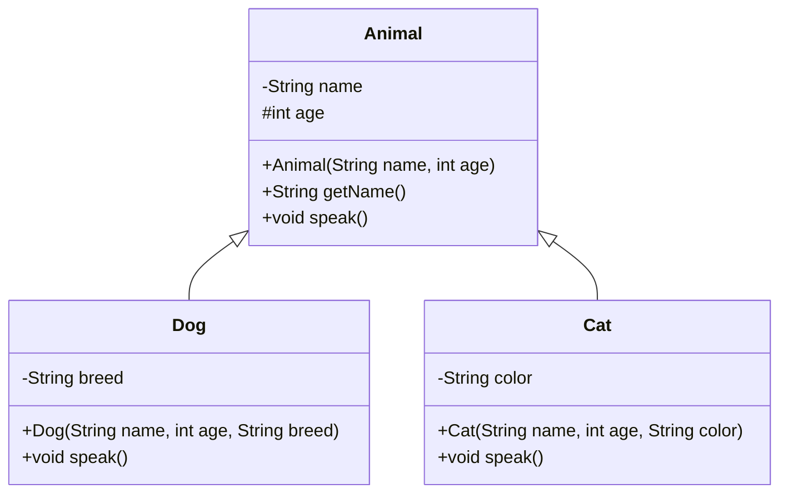

---

## 🧬 Comprehensive Java Inheritance Note

### 🔑 Key Concepts

| Concept                  | Description                                                              |
| ------------------------ | ------------------------------------------------------------------------ |
| **Inheritance**          | A subclass inherits fields and methods from a superclass using `extends` |
| **protected**            | Accessible in subclass (even in another package)                         |
| **private**              | Hidden from subclass; use public getter/setter to access                 |
| **this**                 | Refers to current object or resolves naming conflicts                    |
| **super**                | Calls superclass constructor or method                                   |
| **Method Overriding**    | Subclass redefines a method from superclass                              |
| **Constructor Chaining** | Superclass constructor is invoked first via `super()`                    |

---

## 🎯 Objective

Create a class hierarchy with:

* Superclass `Animal`
* Subclasses `Dog` and `Cat`
* Use `protected`, `private`, `this`, and constructor chaining correctly
* Access private members using public getters
* Highlight `this` usage

---

## 🔩 Full Runnable Java Code

```java
// Superclass
class Animal {
    protected int age;             // ✅ protected: can be accessed in subclass
    private String name;           // ❌ private: cannot be directly accessed

    // Constructor with 'this' to resolve shadowing
    public Animal(String name, int age) {
        this.name = name;          // 'this' resolves conflict with parameter
        this.age = age;
    }

    // Public getter for private variable
    public String getName() {
        return name;
    }

    // Speak method to be overridden
    public void speak() {
        System.out.println(getName() + " makes a generic sound.");
    }
}

// Subclass Dog
class Dog extends Animal {
    private String breed;

    public Dog(String name, int age, String breed) {
        super(name, age); // Constructor chaining
        this.breed = breed;
    }

    @Override
    public void speak() {
        // Access private 'name' via public getter
        System.out.println(getName() + " is a " + breed + " and barks at age " + age);
    }
}

// Subclass Cat
class Cat extends Animal {
    private String color;

    public Cat(String name, int age, String color) {
        super(name, age);
        this.color = color; // 'this' is optional here, no conflict
    }

    @Override
    public void speak() {
        System.out.println(getName() + " is a " + color + " cat, age " + age + ", and meows.");
    }
}

// Main class
public class InheritanceDemo {
    public static void main(String[] args) {
        Animal generic = new Animal("Creature", 5);
        Dog dog = new Dog("Buddy", 3, "Labrador");
        Cat cat = new Cat("Whiskers", 2, "white");

        // Demonstrate inheritance and behavior
        generic.speak(); // Creature makes a generic sound.
        dog.speak();     // Buddy is a Labrador and barks at age 3
        cat.speak();     // Whiskers is a white cat, age 2, and meows.
    }
}
```

---

## 📊 UML Diagram (Mermaid)



---

## ✅ Summary Table

| Feature               | Location             | Purpose                                      | Accessed How              |
| --------------------- | -------------------- | -------------------------------------------- | ------------------------- |
| `protected int age`   | Superclass           | Shared data, accessible in subclass          | Directly via `age`        |
| `private String name` | Superclass           | Encapsulation                                | Via `getName()`           |
| `this`                | Constructor          | Resolve shadowing (e.g., `this.name = name`) | Optional if no conflict   |
| `super()`             | Subclass constructor | Call superclass constructor                  | Must be first statement   |
| Overriding            | Subclass             | Customize inherited method                   | `@Override` annotation    |
| Polymorphism          | `Animal` reference   | Enables dynamic binding                      | `Animal ref = new Dog();` |

---

