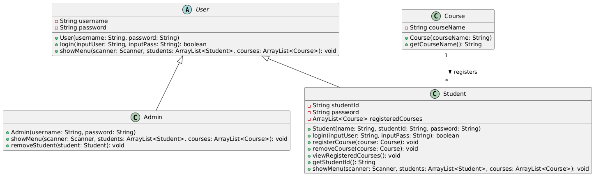

# **Course Registration System**

## **Group Members**
1. Tan Zhi Ming (A23CS0189)
2. Lee Yin Shen (A23CS0236)

## **Project Description**
The **Course Registration System** is a Java-based, menu-driven program that allows users to log in as either an admin or a student. The system starts with a main menu where users can choose to log in as Admin, log in as Student, or Exit the program. Admins can add and remove students, add courses, and view all students (displayed as Name (ID)). Students can register for courses, remove registered courses, and view their registered courses. The system uses core Java Object-Oriented Programming (OOP) concepts, exception handling, and dynamic data storage with `ArrayList`.

---

### ✅ Chapter 5: Vectors and ArrayList
- `ArrayList<Student>` is used to store all students in the system.
- `ArrayList<Course>` stores all available courses.
- Each `Student` object has its own `ArrayList<Course>` for registered courses.
- The program demonstrates usage of `.add()`, `.remove()`, `.get()`, and enhanced `for` loops for dynamic data management.

```java
ArrayList<Student> students = new ArrayList<>();
ArrayList<Course> courses = new ArrayList<>();
students.add(new Student("John Doe", "S123", "pass123"));
courses.add(new Course("Mathematics"));
student.registerCourse(courses.get(0));
students.remove(0);
```

### ✅ Chapter 6: Class Relationships
- **Inheritance**: The abstract class `User` is extended by both `Student` and `Admin`, demonstrating classic inheritance.
- **Association**: Each `Student` has an `ArrayList<Course>` for their registered courses, showing a "has-a" relationship between `Student` and `Course`.


```java
abstract class User {
    protected String username;
    protected String password;
    // ...
}

class Student extends User {
    private String studentId;
    private ArrayList<Course> registeredCourses;
    // ...
}

class Admin extends User {
    // ...
    public void showMenu(Scanner scanner, ArrayList<Student> students, ArrayList<Course> courses) {
        // Interacts with students and courses
    }
}
```

### ✅ Chapter 7: Inheritance
- The abstract class `User` defines shared attributes (`username`, `password`) and methods (`login`, `showMenu`).
- `Admin` and `Student` both inherit from `User` and implement/override the `showMenu` method.
- This structure supports code reuse and logical hierarchy in the program.

```java
abstract class User {
    protected String username;
    protected String password;
    public abstract void showMenu(Scanner scanner, ArrayList<Student> students, ArrayList<Course> courses);
}

class Admin extends User {
    // ...
    @Override
    public void showMenu(Scanner scanner, ArrayList<Student> students, ArrayList<Course> courses) {
        // Admin menu implementation
    }
}

class Student extends User {
    // ...
    @Override
    public void showMenu(Scanner scanner, ArrayList<Student> students, ArrayList<Course> courses) {
        // Student menu implementation
    }
}
```

### ✅ Chapter 8: Polymorphism
- The `showMenu` method is overridden in both `Admin` and `Student` subclasses.
- When `showMenu` is called on a `User` reference, Java determines at runtime which version to execute based on the actual object type (admin or student).
- This is an example of **method overriding** — a form of polymorphism.

```java
User user1 = new Admin("admin", "admin123");
User user2 = new Student("John Doe", "S123", "pass123");

user1.showMenu(scanner, students, courses); // Shows admin menu
user2.showMenu(scanner, students, courses); // Shows student menu
```

### ✅ Chapter 9: Exception Handling
- The program uses `try-catch` blocks to handle:
  - Invalid numeric input (e.g., entering letters when expecting numbers in menus)
  - Invalid index selection from course or student lists
- This ensures the program runs smoothly without crashing on user mistakes.

```java
try {
    int mainChoice = Integer.parseInt(scanner.nextLine());
    // ...
} catch (NumberFormatException e) {
    System.out.println("Invalid input. Please enter a number.");
    continue;
}

// Example for removing a student
System.out.print("Enter student number to remove: ");
int removeIndex = scanner.nextInt() - 1;
scanner.nextLine();
if (removeIndex >= 0 && removeIndex < students.size()) {
    students.remove(removeIndex);
    System.out.println("Student removed.");
} else {
    System.out.println("Invalid student number.");
}
```

---

## **How to Use**
1. Compile the program:
   ```
   javac CourseRegistrationSystem.java
   ```

2. Run the program:
   ```
   java CourseRegistrationSystem
   ```

3. Use the main menu to navigate:
   ```
   === Course Registration System ===
   1. Login as Admin
   2. Login as Student
   3. Exit
   ```

4. **Admin Login:**
   - Enter Admin ID: `admin`
   - Enter password: `admin123`
   - Admin can add students, add courses, view all students (displayed as Name (ID)), and remove students.
   
   **Admin Menu:**
   ```
   --- Admin Menu ---
   1. Add Student
   2. Add Course
   3. View All Students
   4. Remove Student
   5. Logout
   ```

5. **Student Login:**
   - Enter the Student ID and password as set by the admin.
   - Students can register for courses, remove registered courses, and view their registered courses.
   
   **Student Menu:**
   ```
   --- Student Menu ---
   1. Register Course
   2. Remove Registered Course
   3. View Registered Courses
   4. Logout
   ```

6. **Exit:**
   - Select option 3 to exit the program.

---

# Course Registration System

## 1. Classes

### **User (Abstract Class)**
The `User` class is the parent class for both `Admin` and `Student`. It contains two attributes:
- **`username`**: Stores the username of the user.
- **`password`**: Stores the password of the user.

The `login` method is used to verify user credentials, and the abstract method `showMenu` is overridden by both the `Admin` and `Student` classes to define user-specific menus.

### **Admin (Subclass of User)**
The `Admin` class inherits from `User`. It adds functionality specific to administrators, such as:
- Adding students.
- Adding courses.
- Viewing all students.
- Removing students.

It overrides the `showMenu` method to display a menu specific to admin tasks.

### **Student (Subclass of User)**
The `Student` class also inherits from `User` and has additional attributes:
- **`studentId`**: A unique identifier for the student.
- **`registeredCourses`**: An `ArrayList` of courses that the student is registered for.

The `Student` class overrides the `showMenu` method to display a menu specific to student actions, such as registering for courses, removing courses, and viewing registered courses.

### **Course**
The `Course` class represents a course in the system. It has the following attribute:
- **`courseName`**: Stores the name of the course.

The `Course` class also has a method `getCourseName()` to return the course name. Each course can be registered by one or more students, creating a **one-to-many** relationship between `Student` and `Course`.

## 2. Relationships

### **Inheritance (Generalization)**
The `Admin` and `Student` classes inherit from the `User` class. This is represented by the arrow pointing from `Admin` and `Student` to `User`, which indicates an **"is-a"** relationship. Both `Admin` and `Student` share common attributes (`username`, `password`) and methods (`login`, `showMenu`) from the `User` class, but they also have their own specific implementations.

### **Association (Usage)**
The `Student` class **uses** the `Course` class through the **`registers`** relationship. This is a **one-to-many** relationship, as indicated by the line with a **'1'** next to `Course` and a **'*'** next to `Student`. This means:
- One student can register for many courses.
- Each course can be associated with many students.

The directional relationship from `Student` to `Course` indicates that the `Student` class knows about and interacts with `Course` (by registering or removing courses). However, the `Course` class does not necessarily need to know about students in this design.

## 3. Method Visibility
The methods shown in the diagram (e.g., `login`, `showMenu`, `registerCourse`, `removeCourse`, etc.) are **public**, meaning they are accessible from other classes. This is important for interactions between classes like `Admin`, `Student`, and `CourseRegistrationSystem`.

## 4. Attributes

- **`User` class** has two attributes:
  - `username`: Represents the credentials for any user (admin or student).
  - `password`: Represents the password for any user.

- **`Student` class** introduces the following:
  - `studentId`: A unique identifier for the student.
  - `registeredCourses`: An `ArrayList` of courses that the student is enrolled in.

- **`Course` class** has one attribute:
  - `courseName`: Stores the name of the course.


## **Conclusion**
This project demonstrates complete application of Java OOP concepts across Chapters 5–9, fulfilling all rubric requirements including dynamic data structures, class relationships, inheritance, polymorphism, and exception handling in a single cohesive console application.
