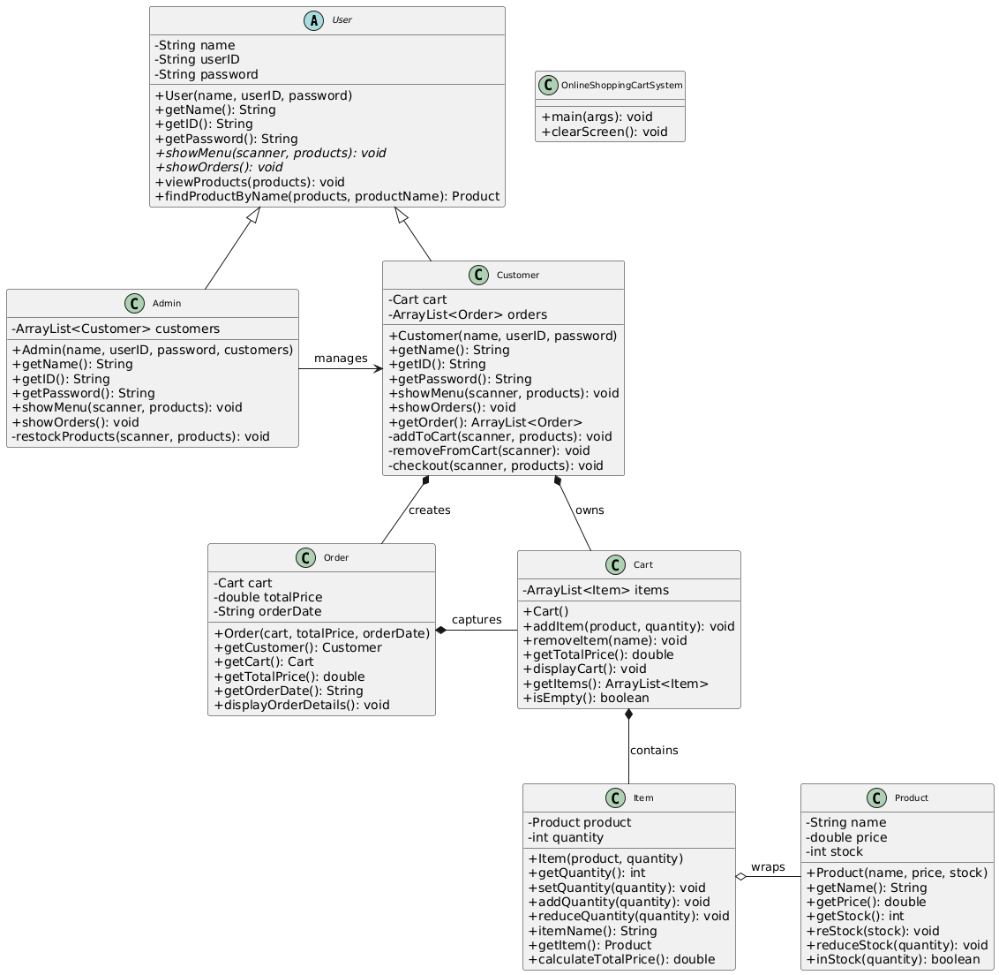

# Online Shopping Cart System
## Group Members
1. [Iman Abadi Bin Mohd Nizwan](https://github.com/imn353) (A23CS0084)
2. [Mohamed Alif Fathi Bin Abdul Latif](https://github.com/AlifFathi) (A23CS0112)

## Project Repository
https://github.com/AlifFathi/OOP-Project-Online-Shoping-Cart

## Project Description
This project is a simple online shopping cart system built using Java. It consists of two different type of users which are customers and admin. For customers, theya re allowed to browse products, add them to their cart, and manage their orders. For admins, they are allowed to look at a list of products, manage their stocks and view orders placed by customers. This projects applies the core principle of Object-Oriented Programming that will be further explained in the next sections.

## Class Diagram

<center>
  
</center>

## Design and Implementation Report
### 1. Brief Class Explanations

* **`OnlineShoppingCartSystem`**: This is the application's entry point, containing the `main` method. It initializes users (Admins and Customers) and products, handles user login, and manages the primary application flow. It also includes a utility method for clearing the console screen.

* **`User` (Abstract Class)**: Serves as the foundational class for all users. It defines common attributes such as `name`, `userID`, and `password`. It also declares abstract methods (`showMenu`, `showOrders`) that must be implemented by its specific user subclasses. Utility methods for viewing and finding products are also provided here.

* **`Admin`**: Inherits from `User`. This class represents an administrator with distinct functionalities, including the ability to restock products and view all customers' orders.

* **`Customer`**: Inherits from `User`. This class represents a typical shopper. It manages a `Cart` for current purchases and maintains a list of past `Order`s, providing functionalities like adding/removing items, viewing the cart, checking out, and reviewing order history.

* **`Product`**: Represents an individual product available in the system. It encapsulates product details like `name`, `price`, and `stock` quantity, along with methods to manage stock levels (reStock, reduceStock, inStock).

* **`Cart`**: Represents a customer's shopping cart. It holds a collection of `Item` objects. Key functionalities include adding items, removing items, calculating the total price of cart contents, and displaying the items currently in the cart.

* **`Item`**: Represents a single entry within a `Cart` or `Order`. It associates a `Product` with a specific `quantity` and provides methods to adjust its quantity and calculate its individual total price.

* **`Order`**: Represents a completed transaction. It captures the state of a `Cart` at the time of purchase, including the `totalPrice` and `orderDate`. It also provides a method to display its detailed contents.

### 2. Implementation of Key OOP Concepts

This section elaborates on how core Object-Oriented Programming (OOP) concepts are implemented throughout the Online Shopping Cart System.

#### a. ArrayList Usage

The system makes extensive use of `java.util.ArrayList` for managing dynamic collections of objects. `ArrayList` is a resizable array implementation, making it highly suitable for scenarios where the number of elements (like users, products, or items in a cart) can change during runtime. No `java.util.Vector` implementations are found in the provided code.

**Code Sections Highlighting `ArrayList` Usage:**

* **`OnlineShoppingCartSystem.java` - Initializing Collections:**
    ```java
    import java.util.ArrayList;

    public class OnlineShoppingCartSystem {
        public static void main(String[] args) {
            ArrayList<User> users = new ArrayList<>();
            ArrayList<Customer> customers = new ArrayList<>();
            ArrayList<Product> products = new ArrayList<>();

            // Populating these lists with initial data
            Customer cust1 = new Customer("MOHAMED ALIF FATHI", "ali", "ali123");
            Customer cust2 = new Customer("SITI NURHALIZA", "siti", "siti123");
            customers.add(cust1);
            customers.add(cust2);
            Admin admin = new Admin("IMAN ABADI", "admin", "admin123", customers);
            users.add(admin);
            users.add(cust1);
            users.add(cust2);

            products.add(new Product("Laptop", 6000.00, 10));
            products.add(new Product("Phone", 3000.00, 20));
            // ... more products
        }
    }
    ```
    At system startup, `ArrayList` is used to create and manage the master lists of `User`s, `Customer`s, and `Product`s.

#### b. Class Relationships

The system demonstrates various types of relationships between classes, which are fundamental to object-oriented design.

* **Association (General "has-a" relationship)**
    * **`Admin` associated with `Customer`**:
        ```java
        public class Admin extends User {
            private ArrayList<Customer> customers; // Admin manages customers
            public Admin(String name, String userID, String password, ArrayList<Customer> customers) {
                super(name, userID, password);
                this.customers = customers; // Customers are passed in, implying they exist independently
            }
            // ...
        }
        ```
        An `Admin` manages a collection of `Customer` objects, but these `Customer` objects are created externally (in `OnlineShoppingCartSystem`) and can exist even if the `Admin` object is removed.

* **Aggregation (Weak "has-a" relationship - part can exist independently)**
    * **`Item` aggregates `Product`**:
        ```java
        public class Item {
            private Product product; // Item makes a copy of a product
            public Item(Product product, int quantity) {
                this.product = product; // Item holds a specific Product
                this.quantity = quantity;
            }
        }
        ```
        An `Item` represents a specific `Product` along with a quantity. 

* **Composition (Strong "has-a" relationship - part cannot exist independently)**
    * **`Customer` is composed of `Cart`**:
        ```java
        public class Customer extends User {
            private Cart cart; // Cart is part of a Customer
            public Customer(String name, String userID, String password) {
                super(name, userID, password);
                this.cart = new Cart(); // Cart is instantiated within the Customer's constructor
            }
        }
        ```
        Each `Customer` object implicitly owns its `Cart`. If the `Customer` object is destroyed, its associated `Cart` object is also destroyed.
    * **`Cart` is composed of `Item`**:
        ```java
        public class Cart {
            private ArrayList<Item> items; // Items are part of a Cart
            public Cart() {
                this.items = new ArrayList<>();
            }
            public void addItem(Product product, int quantity) {
                items.add(new Item(product, quantity)); // Items are created and managed within the Cart
            }
        }
        ```
        `Item` objects are managed and typically created within the `Cart`. An `Item` in this context doesn't meaningfully exist outside of a `Cart`.
    * **`Order` is composed of `Cart`**:
        ```java
        public class Order {
            private Cart cart; // Cart details are part of an Order
            public Order(Cart cart, double totalPrice, String orderDate) {
                this.cart = cart; // Order captures the Cart's state at checkout
                this.totalPrice = totalPrice;
                this.orderDate = orderDate;
            }
        }
        ```
        When an `Order` is created, it takes a `Cart` object, effectively encapsulating its contents as part of the order's immutable record. The `Cart` becomes a component of that specific `Order`.

#### c. Inheritance

Inheritance is a core OOP principle that establishes an "is-a" relationship, promoting code reusability and a hierarchical structure.

* **`Admin` inherits from `User`**:
    ```java
    public class Admin extends User {
        // ... Admin specific fields and methods ...
    }
    ```
    An `Admin` "is a" `User`. It inherits common attributes like `name`, `userID`, `password` and basic behaviors defined in the `User` class, then adds its unique administrative functionalities.

* **`Customer` inherits from `User`**:
    ```java
    public class Customer extends User {
        // ... Customer specific fields and methods ...
    }
    ```
    Similarly, a `Customer` "is a" `User`. It also inherits the common `User` properties and behaviors, extending them with features relevant to a shopping customer.

#### d. Polymorphism

Polymorphism, meaning "many forms," allows objects of different classes to be treated as objects of a common type (their superclass), enabling flexible and adaptable code. This is primarily demonstrated through method overriding.

* **`showMenu()` and `showOrders()` Methods:**
    The `User` abstract class declares `showMenu()` and `showOrders()` as abstract methods, requiring all concrete subclasses to provide their own implementation:
    ```java
    // In User.java
    public abstract void showMenu(Scanner scanner, ArrayList<Product> products);
    public abstract void showOrders();
    ```
    Both `Admin` and `Customer` classes provide their specific implementations for these methods:
    ```java
    // In Admin.java
    public void showMenu(Scanner scanner, ArrayList<Product> products) {
        // Admin-specific menu options and logic
    }
    public void showOrders() {
        // Logic for Admin to view all customers' orders
    }
    ```
    ```java
    // In Customer.java
    public void showMenu(Scanner scanner, ArrayList<Product> products) {
        // Customer-specific menu options and logic
    }
    public void showOrders() {
        // Logic for Customer to view only their own orders
    }
    ```
    In `OnlineShoppingCartSystem.java`, after successful login, the system treats the logged-in user as a generic `User` object, but the `showMenu()` method call dynamically invokes the correct implementation based on whether the `currentUser` is an `Admin` or a `Customer`:
    ```java
    // In OnlineShoppingCartSystem.java
    User currentUser = null;
    // ... (logic to assign Admin or Customer object to currentUser) ...
    currentUser.showMenu(scanner, products); // Polymorphic call: executes Admin's or Customer's showMenu
    ```
    This demonstrates how the same method call can exhibit different behaviors depending on the actual runtime type of the object, a core aspect of polymorphism.

#### e. Exception Handling

The system incorporates `try-catch` blocks to manage potential runtime errors effectively, primarily focusing on `NumberFormatException` when parsing user input and general `Exception` for broader error conditions. This strategy prevents unexpected program termination and provides informative feedback to the user.

**Code Sections Highlighting Exception Handling:**

* **In `Admin.java` (within `showMenu` and `restockProducts` methods):**
    ```java
    // Admin.java - showMenu example
    public void showMenu(Scanner scanner, ArrayList<Product> products) {
        while (!logout) {
            try {
                // ... menu choice processing ...
            } catch (Exception e) { // Catches general exceptions for menu operations
                System.out.println("An error occurred: " + e.getMessage());
                System.out.println("Please try again.");
            }
        }
    }

    // Admin.java - restockProducts example
    private void restockProducts(Scanner scanner, ArrayList<Product> products) {
        try {
            // ... input reading ...
            quantity = Integer.parseInt(quantityInput); // Potential NumberFormatException
            // ... restocking logic ...
        } catch (NumberFormatException e) {
            System.out.println("Invalid quantity. Please enter a valid number."); // Specific handling for bad numeric input
            return;
        } catch (Exception e) {
            System.out.println("Error restocking product: " + e.getMessage()); // General error for restock process
        }
    }
    ```

* **In `Customer.java` (within `showMenu`, `addToCart`, `removeFromCart`, and `checkout` methods):**
    ```java
    // Customer.java - addToCart example
    private void addToCart(Scanner scanner, ArrayList<Product> products) {
        try {
            // ... input reading ...
            quantity = Integer.parseInt(quantityInput); // Potential NumberFormatException
            // ... add to cart logic ...
        } catch (NumberFormatException e) {
            System.out.println("Invalid quantity. Please enter a valid number.");
            return;
        } catch (Exception e) {
            System.out.println("Error adding item to cart: " + e.getMessage());
        }
    }

    // Customer.java - checkout example
    private void checkout(Scanner scanner, ArrayList<Product> products) {
        try {
            // ... checkout logic ...
        } catch (Exception e) { // Catches any exception during the checkout process
            System.out.println("Error during checkout: " + e.getMessage());
        }
    }
    ```
    This consistent use of `try-catch` blocks across critical user interaction points ensures the application's stability and provides a robust user experience by effectively managing potential errors.

### How to use
1. Compile the Java source files:
    ```bash
    javac OnlineShoppingCartSystem.java
    ```
2. Run the application:
    ```bash
    java OnlineShoppingCartSystem
    ```
3. Login menu for both customer and admin 
    ```
    --- Welcome to Electronic Shopping Cart System ---
    Username:
    Password:
    ```
4. The login page takes username and password as input.
    - Admin Credentials
        - Username: `admin`
        - Password: `admin123`

    - Customer Credentials.
      - Customer 1
        - Username: `ali`
        - Password: `ali123`
      - Customer 2
        - Username: `siti`
        - Password: `siti123`
        
5. The admin menu provides options to view and restock products, while the customer menu enables adding, removing, and checking out items from the cart.
6. When the any of the user logs out, they will be prompted if they want to exit the system. To test the overall system functionality, it is recommended to not exit the system as all of the data will be lost. For example, after a customer has made an order, the admin can view the orders that was placed. Simply log out from customer and log in as an admin to view the orders. The same applies to other functionalities. 

    - Example prompt:
      ```
      Do you want to exit the system? (yes to exit, press Enter to continue):
      Your choice:
      ```

