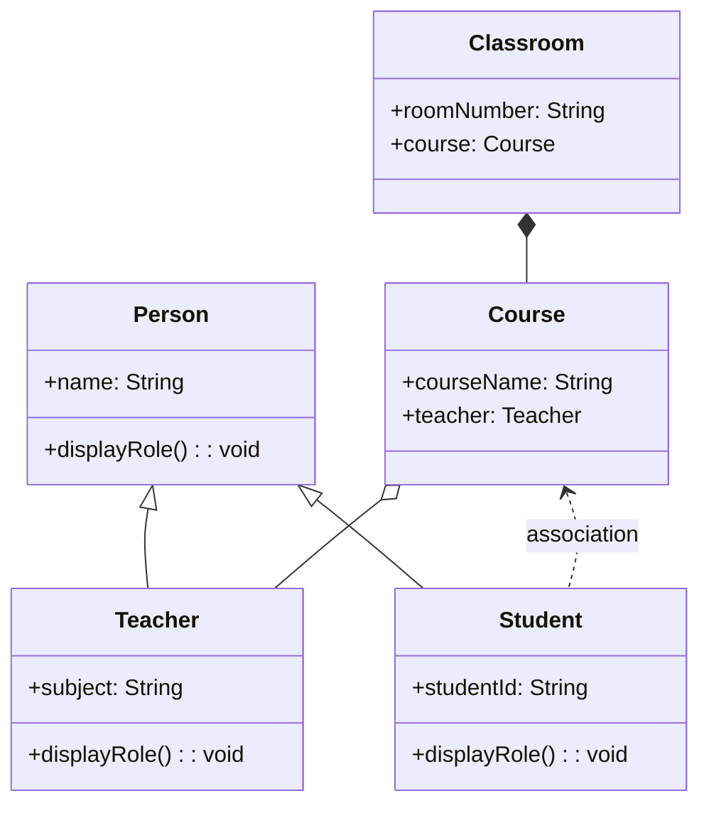

Here is a **Java Lab Exercise** that demonstrates the key **class relationships**: **Association**, **Aggregation**, **Composition**, **Inheritance**, and **Polymorphism**, all in one coherent example.

---

## 🔬 **Lab Exercise: Class Relationships in a School Management System**

### 📝 **Learning Objectives**

* Understand and implement:

  * **Association**
  * **Aggregation**
  * **Composition**
  * **Inheritance**
  * **Polymorphism**

---

## 📘 **Scenario**

Create a simple school management system that models the relationships between the following classes:

* `Person` (Base class)
* `Student`, `Teacher` (Inheritance from `Person`)
* `Course` (Aggregates `Teacher`)
* `Classroom` (Composes `Course`)
* `Student` associated with `Course` (Association)
* Implement polymorphism using overridden methods from the `Person` class.

---

## 🧪 **Instructions**

1. Implement the class structure as shown.
2. Demonstrate the relationships and polymorphism in the `Main` class.
3. Add appropriate comments to explain each relationship.

---

## 🧩 **UML (Mermaid Style)**




---

## 🛠️ **Code with Errors and Missing Statements**

This code version introduces:

* ❌ **2-3 errors** (e.g., typo, access modifier, undefined variable)
* ⛔ **2-3 missing lines** (e.g., uninitialized object, missing method call)

---

### 💻 **Incomplete Code: `SchoolSystem.java`**

```java
class Person {
    protected String name;

    public Person(String name) {
        this.name = name;
    }

    public void displayRole() {
        System.out.println("I am a person.");
    }
}

// Inheritance & Polymorphism
class Student extends Person {
    private String studentId;

    public Student(String name, String studentId) {
        super(name);
        this.studentId = studentId;
    }

    @Override
    public void displayRole() {
        System.out.println("I am a student. My name is " + name);
    }

    // Missing method: enrollCourse(Course course)
}

// Inheritance & Polymorphism
class Teacher extends Person {
    private String subject;

    public Teacher(String name, String subject) {
        super(name);
        this.subject = subject;
    }

    @Override
    public void displayRole() {
        System.out.println("I am a teacher. My name is " + name + " and I teach " + subject);
    }

    public String getSubject() {
        return subject;
    }
}

// Aggregation
class Course {
    String courseName;
    Teacher teacher;

    // Error: constructor missing parameter for courseName
    public Course(Teacher teacher) {
        this.teacher = teacher;
    }

    public void showCourseInfo() {
        // Error: courseName is possibly null
        System.out.println("Course: " + courseName + ", Taught by: " + teacher.name);
    }
}

// Composition
class Classroom {
    String roomNumber;
    private Course course;

    public Classroom(String roomNumber, String courseName, Teacher teacher) {
        this.roomNumber = roomNumber;

        // Error: Course constructor expects one parameter, but two passed
        this.course = new Course(courseName, teacher); 
    }

    public void showClassroomInfo() {
        System.out.println("Classroom: " + roomNumber);
        // Missing: call method to show course info
    }

    public Course getCourse() {
        return course;
    }
}

public class SchoolSystem {
    public static void main(String[] args) {
        Person p1 = new Student("Ali", "S100");
        Person p2 = new Teacher("Ms. Zara", "Biology");

        p1.displayRole();
        p2.displayRole();

        Teacher t = new Teacher("Mr. Samad", "History");
        Classroom c = new Classroom("R202", "World History", t);
        c.showClassroomInfo();

        Student student = new Student("Ali", "S100");

        // Missing: student enrolls in course from classroom
    }
}
```

---

## ✅ **Your Task**

> ### 🎯 Objectives:

Fix the **syntactic and semantic errors** and **fill in the missing logic** to make the system compile and run correctly.

---

### 🧩 **Fix the Errors**

1. ✅ **Fix the constructor of `Course`**

   * The constructor should accept `String courseName` and `Teacher teacher` as parameters.

2. ✅ **Fix constructor call in `Classroom`**

   * `new Course(courseName, teacher)` will work only after fixing Course constructor.

3. ✅ **Fix null courseName issue**

   * Ensure `courseName` is initialized properly in the constructor.

---

### ✍️ **Complete the Missing Statements**

1. ⛔ **Implement `enrollCourse()` method** inside `Student` class:

2. ⛔ **Call `course.showCourseInfo()` in `showClassroomInfo()`**:

3. ⛔ **Let the student enroll in the classroom’s course** in `main()`:

---

## ✅ **Expected Output (After Fixes)**

```
I am a student. My name is Ali
I am a teacher. My name is Ms. Zara and I teach Biology
Classroom: R202
Course: World History, Taught by: Mr. Samad
Ali is enrolled in World History
```

---

## 📚 **Explanation Recap**

| Concept      | Example in Code                                    |
| ------------ | -------------------------------------------------- |
| Inheritance  | `Student` and `Teacher` inherit `Person`           |
| Polymorphism | `displayRole()` is overridden                      |
| Association  | `Student` associates with a `Course`               |
| Aggregation  | `Course` has a `Teacher` (can exist independently) |
| Composition  | `Classroom` owns a `Course` (created internally)   |


