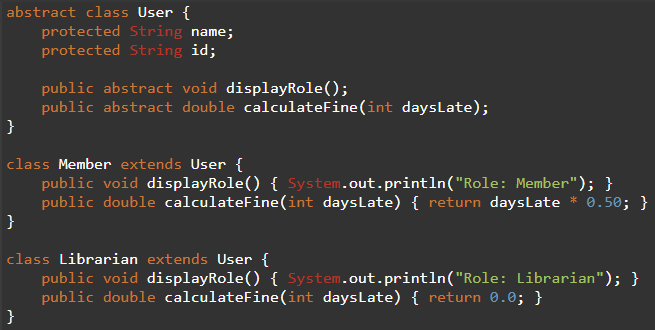

# 📚 Library Management System – OOP Mini Project

This OOP mini project simulates a **Library Management System** that allows users to add, remove, and borrow books using core object-oriented programming concepts such as **inheritance**, **polymorphism**, **composition**, and **exception handling**.

---

## 👥 Team Members

| Name      | Role       | Responsibilities |
|-----------|------------|------------------|
| AHMAD ZIYAAD BIN MOHD ABBAS (A23CS0206) | Person A | Data structures, relationships, exception handling |
| NURUL ADRIANA BINTI KAMAL JEFRI (A23C0258) | Person B | Inheritance, polymorphism, documentation & testing |

---

## 🛠️ Features Implemented

- ✅ Add, list, find, and remove books in a library
- ✅ Borrowed book tracking for members
- ✅ Custom exception for invalid or missing books
- ✅ Abstract superclass `User` with subclasses `Member` and `Librarian`
- ✅ Method overriding (`calculateFine()`, `displayRole()`)
- ✅ Dynamic binding with polymorphism

---

## 🧠 Object-Oriented Concepts with Implementation & Code Examples

| Concept                | Implementation Summary                                                                         | Code Example                                              |
| ---------------------- | ---------------------------------------------------------------------------------------------- | --------------------------------------------------------- |
| **Inheritance**        | `Member` and `Librarian` are subclasses that extend the abstract superclass `User`.            |               |
| **Method Overriding**  | Subclasses override methods from `User` such as `displayRole()` and `calculateFine()`.         |    |
| **Polymorphism**       | A `User` reference points to a `Member` or `Librarian`, allowing dynamic behavior.             |             |
| **Dynamic Binding**    | Java decides at runtime which version of the overridden method to call.                        |        |
| **Encapsulation**      | Class fields are private, and accessed through public methods.                                 |           |
| **Composition**        | `LibraryCard` owns a `Member` instance. If the member is deleted, the card is affected.        |               |
| **Association**        | `Library` can be associated with a `Librarian` (they can exist independently).                 |               |
| **Aggregation**        | `Library` uses a `Librarian`, but if `Library` is deleted, `Librarian` remains intact.         |               |
| **Exception Handling** | Handles input validation and custom exceptions like `BookNotFoundException` using `try-catch`. |  |

---

## 🔍 Sample Output

=== Adding Books ===  
Book added: The Hobbit  
Book added: The Alchemist 

=== Listing All Books ===  
Current books in library:  
[The Hobbit] by J.R.R. Tolkien (ISBN: 1111)  
[The Alchemist] by Paulo Coelho (ISBN: 2222)

=== Finding Book ===  
[The Hobbit] by J.R.R. Tolkien (ISBN: 1111)

=== Removing Book ===  
Removed book with ISBN: 1111

=== Listing Remaining Books ===  
Current books in library:  
[The Alchemist] by Paulo Coelho (ISBN: 2222)

=== Member Borrows a Book ===  
Ziyaad borrowed: The Alchemist  
Ziyaad has borrowed:  
[The Alchemist] by Paulo Coelho (ISBN: 2222)

=== Member Info ===  
Role: Member  
Fine for 3 late days: RM1.5

=== Polymorphism Test ===  
Role: Member  
Fine for 5 late days: RM2.5  
Role: Librarian  
Fine for 5 late days: RM0.0

=== Association Test ===  
Librarian assigned to library: Farah  
Library deleted (set to null). Librarian still exists:  
Role: Librarian  
Fine for 7 late days: RM0.0

=== Aggregation Test ===  
Library 2 now has librarian: Daniel  
Library 2 deleted (set to null). Librarian still exists and works:  
Role: Librarian  
Fine for 10 late days: RM0.0

=== Composition Test ===  
Library Card belongs to: Hakim (ID: M003)  
Member object deleted (set to null). Trying to use LibraryCard...  
Library Card has no valid owner.  
Warning: LibraryCard still exists, but is now detached from its original owner.

=== Exception Handling Test ===  
Caught exception: Book not found: ISBN 9999

---

## ▶️ How to Run

1. Compile the program.
2. Run the program.

---

## 📄 UML Class Diagram

---

